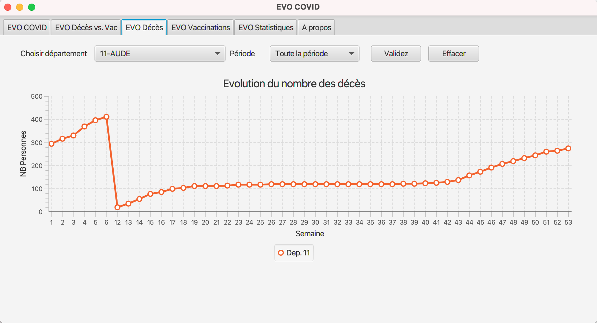

# Démonstration 
La page d'accueil de **EVO COVID** présente cinq onglets (EVO COVID, EVO Décès, EVO VCaccination, EVO Statistiques et A propos). 

## Onglet EVO COVID
Cet onglet présente des statistiques sur les nombres de décès, de patients en réanimation, d'hospitalisation et de vaccination par département.

Les nombres calculés sont affichés par département. J'ai choisi d'afficher les mêmes informations sur le `BarChart` et le `PieChart` pour des raisons ergonomiques. 
## Onglet EVO Décès vs. Vac
Cet onglet présente deux courbes différentes. La première (en haut) concerne les statistiques sur les nombres de décès par département et pour une période bien déterminée. La deuxième courbe (en bas) concerne les statistiques sur les injections (injection 1 ou 2 ou les deux ensemble) vaccinales par département.  

Le but à travers l'affichage des deux courbe est de pourvoir analyser les correlations entre le nombre de décès et et le nombre de vaccination. 

## Onglet EVO Décès
Cet onglet présente des statistiques sur les nombres de décès par département et pour une période bien déterminée. Il est possible d'afficher une seule courbe comme présenté dans la figure suivante (nombre de décès dans le département 11 pour la période complète) :

 
EVO COVID permet aussi de tracer plusieurs courbes pour plusieurs départements dans le but de faire des comparaisons des statistiques comme illustré dans la figure suivante (évolution du nombre des décès dans les départements 11, 2B et 54) : 

## Onglet EVO Vaccination
Cet onglet présente des statistiques sur les injections vaccinales par département.

L'utilisateur peut choisir ici d'afficher seulement les informations sur la première injection ou la deuxième injection ou bien le cumul des deux injections. 
## Onglet EVO Statistiques
Cet onglet présente des statistiques globales (au niveau national) sur les nombres de décès, de patients en réanimation, d'hospitalisation et de vaccination.

Comme illustré dans la figure ci-dessus, EVO COVID affiche la liste des départements les plus touchés en terme du nombre de décès ou en terme de vaccination. 
## Onglet A propos
Cet onglet présente les informations sur le développeur de EVO COVID.

## Gestion des erreurs 
EVO COVID gère les erreurs d'innatention lors de son utilisation. Par exemple, lorsque l'utilisateur demande d'afficher une courbe pour un même département deux fois, un message d'erreur s'affiche (voir figure ci après). 
